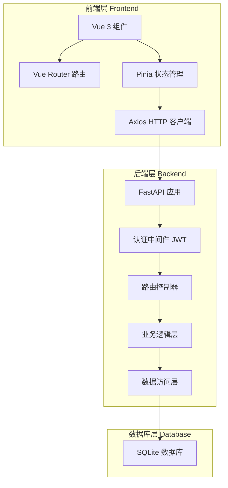
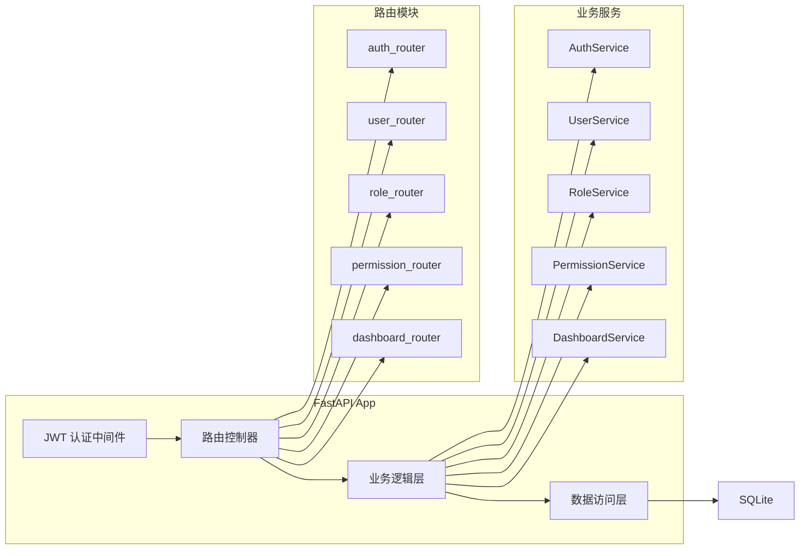
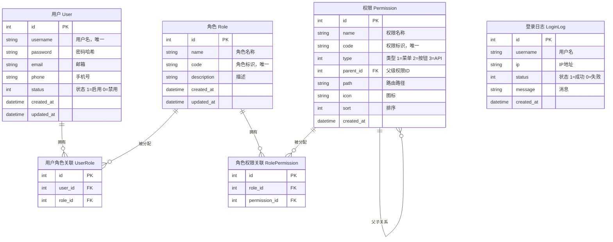

## 1. 架构设计



## 2. 技术说明

- **前端框架**：Vue@3.5 + TypeScript + Vite@5
- **UI组件库**：Element Plus（经典后台管理风格）
- **路由**：Vue Router@4
- **状态管理**：Pinia（持久化 token 与用户信息）
- **HTTP 客户端**：Axios（请求/响应拦截器，自动携带 Token）
- **后端框架**：Python 3.11+ / FastAPI
- **ORM**：SQLAlchemy 2.0（异步）
- **数据库**：SQLite（开发阶段，可切换 PostgreSQL/MySQL）
- **认证**：JWT（python-jose + passlib）
- **数据校验**：Pydantic v2
- **数据库迁移**：Alembic
- **初始化工具**：前端 `npm create vite@latest`，后端手动搭建 FastAPI 项目结构

## 3. 路由定义

### 前端路由

| 路由 | 页面 | 权限要求 |
|------|------|----------|
| `/login` | 登录页 | 公开 |
| `/` | 重定向至 `/dashboard` | 已登录 |
| `/dashboard` | 仪表盘 | 已登录 |
| `/users` | 用户管理 | `user:list` |
| `/roles` | 角色管理 | `role:list` |
| `/permissions` | 权限管理 | `perm:list` |
| `/profile` | 个人中心 | 已登录 |

### 后端 API 路由

| 方法 | 路由 | 用途 |
|------|------|------|
| POST | `/api/auth/login` | 用户登录 |
| GET | `/api/auth/me` | 获取当前用户信息 |
| PUT | `/api/auth/password` | 修改密码 |
| GET | `/api/users` | 用户列表（分页、搜索、筛选） |
| POST | `/api/users` | 创建用户 |
| GET | `/api/users/{id}` | 获取用户详情 |
| PUT | `/api/users/{id}` | 更新用户 |
| DELETE | `/api/users/{id}` | 删除用户 |
| PUT | `/api/users/{id}/roles` | 分配用户角色 |
| PUT | `/api/users/{id}/status` | 启用/禁用用户 |
| GET | `/api/roles` | 角色列表 |
| POST | `/api/roles` | 创建角色 |
| GET | `/api/roles/{id}` | 获取角色详情 |
| PUT | `/api/roles/{id}` | 更新角色 |
| DELETE | `/api/roles/{id}` | 删除角色 |
| PUT | `/api/roles/{id}/permissions` | 分配角色权限 |
| GET | `/api/permissions` | 权限树 |
| POST | `/api/permissions` | 创建权限 |
| PUT | `/api/permissions/{id}` | 更新权限 |
| DELETE | `/api/permissions/{id}` | 删除权限 |
| GET | `/api/dashboard/stats` | 仪表盘统计数据 |
| GET | `/api/dashboard/login-logs` | 最近登录记录 |

## 4. API 定义

```typescript
// ===== 通用类型 =====
interface PaginatedRequest {
  page?: number;      // 页码，默认 1
  pageSize?: number;  // 每页数量，默认 10
  keyword?: string;   // 搜索关键词
}

interface PaginatedResponse<T> {
  items: T[];
  total: number;
  page: number;
  pageSize: number;
}

// ===== 认证相关 =====
interface LoginRequest {
  username: string;
  password: string;
}

interface LoginResponse {
  token: string;
  user: UserInfo;
}

interface UserInfo {
  id: number;
  username: string;
  email: string;
  phone: string;
  status: number;       // 1=启用, 0=禁用
  roles: RoleInfo[];
  permissions: string[];
  createdAt: string;
}

interface ChangePasswordRequest {
  oldPassword: string;
  newPassword: string;
}

// ===== 用户管理 =====
interface UserItem {
  id: number;
  username: string;
  email: string;
  phone: string;
  status: number;
  roles: RoleSimple[];
  createdAt: string;
}

interface UserCreateRequest {
  username: string;
  password: string;
  email?: string;
  phone?: string;
  status?: number;
  roleIds?: number[];
}

interface UserUpdateRequest {
  email?: string;
  phone?: string;
  status?: number;
}

interface AssignRolesRequest {
  roleIds: number[];
}

// ===== 角色管理 =====
interface RoleSimple {
  id: number;
  name: string;
  code: string;
}

interface RoleInfo {
  id: number;
  name: string;
  code: string;
  description: string;
  userCount: number;
  permissionIds: number[];
  createdAt: string;
}

interface RoleCreateRequest {
  name: string;
  code: string;
  description?: string;
  permissionIds?: number[];
}

interface RoleUpdateRequest {
  name?: string;
  description?: string;
}

interface AssignPermissionsRequest {
  permissionIds: number[];
}

// ===== 权限管理 =====
interface PermissionNode {
  id: number;
  name: string;
  code: string;
  type: number;         // 1=菜单, 2=按钮, 3=API
  parentId: number | null;
  path?: string;
  icon?: string;
  sort: number;
  children?: PermissionNode[];
}

interface PermissionCreateRequest {
  name: string;
  code: string;
  type: number;
  parentId?: number;
  path?: string;
  icon?: string;
  sort?: number;
}

// ===== 仪表盘 =====
interface DashboardStats {
  userCount: number;
  roleCount: number;
  permissionCount: number;
  todayLoginCount: number;
}

interface LoginLog {
  id: number;
  username: string;
  ip: string;
  status: number;       // 1=成功, 0=失败
  message: string;
  createdAt: string;
}
```

## 5. 服务端架构图



## 6. 数据模型

### 6.1 数据模型定义



### 6.2 数据定义语言

```sql
-- 用户表
CREATE TABLE users (
    id INTEGER PRIMARY KEY AUTOINCREMENT,
    username VARCHAR(50) NOT NULL UNIQUE,
    password VARCHAR(255) NOT NULL,
    email VARCHAR(100),
    phone VARCHAR(20),
    status INTEGER DEFAULT 1,
    created_at DATETIME DEFAULT CURRENT_TIMESTAMP,
    updated_at DATETIME DEFAULT CURRENT_TIMESTAMP
);

-- 角色表
CREATE TABLE roles (
    id INTEGER PRIMARY KEY AUTOINCREMENT,
    name VARCHAR(50) NOT NULL,
    code VARCHAR(50) NOT NULL UNIQUE,
    description VARCHAR(255),
    created_at DATETIME DEFAULT CURRENT_TIMESTAMP,
    updated_at DATETIME DEFAULT CURRENT_TIMESTAMP
);

-- 权限表
CREATE TABLE permissions (
    id INTEGER PRIMARY KEY AUTOINCREMENT,
    name VARCHAR(50) NOT NULL,
    code VARCHAR(100) NOT NULL UNIQUE,
    type INTEGER NOT NULL DEFAULT 1,
    parent_id INTEGER,
    path VARCHAR(255),
    icon VARCHAR(50),
    sort INTEGER DEFAULT 0,
    created_at DATETIME DEFAULT CURRENT_TIMESTAMP,
    FOREIGN KEY (parent_id) REFERENCES permissions(id)
);

-- 用户角色关联表
CREATE TABLE user_roles (
    id INTEGER PRIMARY KEY AUTOINCREMENT,
    user_id INTEGER NOT NULL,
    role_id INTEGER NOT NULL,
    UNIQUE(user_id, role_id),
    FOREIGN KEY (user_id) REFERENCES users(id) ON DELETE CASCADE,
    FOREIGN KEY (role_id) REFERENCES roles(id) ON DELETE CASCADE
);

-- 角色权限关联表
CREATE TABLE role_permissions (
    id INTEGER PRIMARY KEY AUTOINCREMENT,
    role_id INTEGER NOT NULL,
    permission_id INTEGER NOT NULL,
    UNIQUE(role_id, permission_id),
    FOREIGN KEY (role_id) REFERENCES roles(id) ON DELETE CASCADE,
    FOREIGN KEY (permission_id) REFERENCES permissions(id) ON DELETE CASCADE
);

-- 登录日志表
CREATE TABLE login_logs (
    id INTEGER PRIMARY KEY AUTOINCREMENT,
    username VARCHAR(50) NOT NULL,
    ip VARCHAR(50),
    status INTEGER DEFAULT 1,
    message VARCHAR(255),
    created_at DATETIME DEFAULT CURRENT_TIMESTAMP
);

-- 初始数据：超级管理员
INSERT INTO users (username, password, email, status) VALUES
('admin', '$2b$12$...', 'admin@example.com', 1);

-- 初始角色
INSERT INTO roles (name, code, description) VALUES
('超级管理员', 'super_admin', '系统最高权限角色'),
('普通管理员', 'admin', '普通管理权限'),
('普通用户', 'user', '基础用户权限');

-- 初始权限
INSERT INTO permissions (name, code, type, parent_id, path, icon, sort) VALUES
('仪表盘', 'dashboard', 1, NULL, '/dashboard', 'Monitor', 1),
('用户管理', 'user:list', 1, NULL, '/users', 'User', 2),
('用户新增', 'user:create', 2, NULL, NULL, NULL, 3),
('用户编辑', 'user:update', 2, NULL, NULL, NULL, 4),
('用户删除', 'user:delete', 2, NULL, NULL, NULL, 5),
('角色管理', 'role:list', 1, NULL, '/roles', 'UserFilled', 6),
('角色新增', 'role:create', 2, NULL, NULL, NULL, 7),
('角色编辑', 'role:update', 2, NULL, NULL, NULL, 8),
('角色删除', 'role:delete', 2, NULL, NULL, NULL, 9),
('权限管理', 'perm:list', 1, NULL, '/permissions', 'Lock', 10),
('权限新增', 'perm:create', 2, NULL, NULL, NULL, 11),
('权限编辑', 'perm:update', 2, NULL, NULL, NULL, 12),
('权限删除', 'perm:delete', 2, NULL, NULL, NULL, 13);

-- 为超级管理员分配所有权限
INSERT INTO role_permissions (role_id, permission_id)
SELECT 1, id FROM permissions;

-- 创建 admin 用户并分配角色
INSERT INTO user_roles (user_id, role_id) VALUES (1, 1);
```