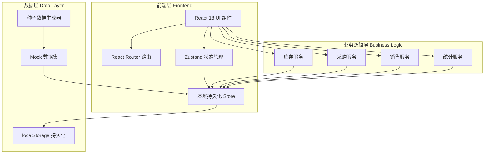
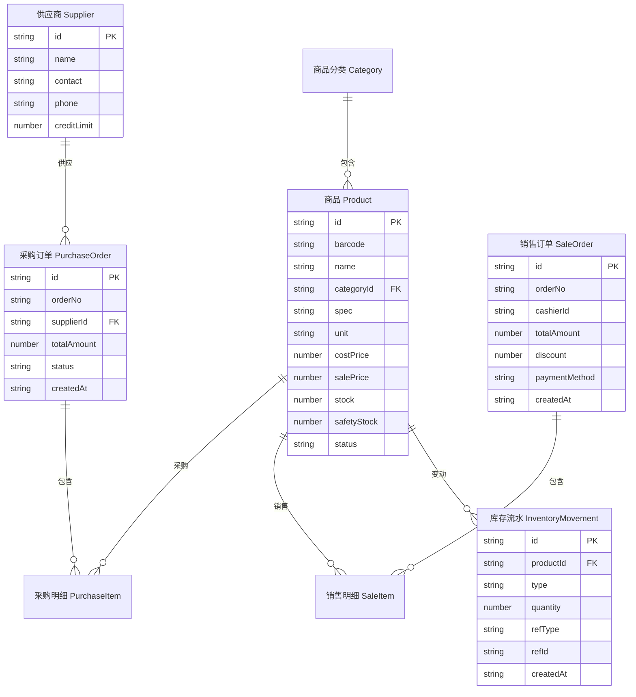

## 1. 架构设计



## 2. 技术说明

- **前端框架**：React@18 + TypeScript + Vite@5
- **样式方案**：TailwindCSS@3 + CSS变量主题系统
- **路由**：React Router@6
- **状态管理**：Zustand（轻量、支持持久化中间件）
- **图标**：lucide-react
- **图表**：自研 SVG 图表组件（折线图、柱状图、环形图、迷你趋势线）
- **数据持久化**：localStorage（Zustand persist 中间件）
- **后端**：无后端，纯前端 Mock 数据，首次加载注入种子数据
- **字体**：Google Fonts - Fraunces / Plus Jakarta Sans / JetBrains Mono
- **初始化工具**：vite-init (`npm create vite@latest`)

## 3. 路由定义

| 路由 | 用途 |
|------|------|
| `/` | 重定向至 `/dashboard` |
| `/dashboard` | 经营驾驶舱首页 |
| `/products` | 商品档案列表 |
| `/products/:id` | 商品详情/编辑 |
| `/products/new` | 新增商品 |
| `/categories` | 商品分类管理 |
| `/suppliers` | 供应商档案 |
| `/purchases` | 采购订单列表 |
| `/purchases/new` | 新建采购订单 |
| `/purchases/:id` | 采购订单详情 |
| `/pos` | 收银开单 |
| `/sales` | 销售单据列表 |
| `/sales/:id` | 销售单详情 |
| `/inventory` | 实时库存 |
| `/inventory/check` | 库存盘点 |
| `/inventory/warnings` | 库存预警 |
| `/inventory/movements` | 出入库流水 |
| `/reports/sales` | 销售报表 |
| `/reports/profit` | 利润分析 |
| `/reports/ranking` | 商品排行 |

## 4. API 定义（前端服务层）

由于采用纯前端方案，"API"以 TypeScript 服务模块形式存在，统一从 Zustand Store 读写数据。

```typescript
// 商品服务
interface Product {
  id: string;
  barcode: string;
  name: string;
  categoryId: string;
  spec: string;        // 规格
  unit: string;        // 单位
  costPrice: number;   // 进价
  salePrice: number;   // 售价
  stock: number;       // 当前库存
  safetyStock: number; // 安全库存
  shelfLife?: number;  // 保质期天数
  status: 'active' | 'inactive';
  imageUrl?: string;
  createdAt: string;
}

// 采购订单
interface PurchaseOrder {
  id: string;
  orderNo: string;
  supplierId: string;
  items: PurchaseItem[];
  totalAmount: number;
  status: 'draft' | 'pending' | 'approved' | 'received' | 'cancelled';
  createdAt: string;
  receivedAt?: string;
}

interface PurchaseItem {
  productId: string;
  quantity: number;
  receivedQuantity: number;
  costPrice: number;
  amount: number;
}

// 销售单
interface SaleOrder {
  id: string;
  orderNo: string;
  cashierId: string;
  items: SaleItem[];
  totalAmount: number;
  discount: number;
  paid: number;
  paymentMethod: 'cash' | 'wechat' | 'alipay' | 'card';
  createdAt: string;
}

interface SaleItem {
  productId: string;
  quantity: number;
  salePrice: number;
  amount: number;
}

// 供应商
interface Supplier {
  id: string;
  name: string;
  contact: string;
  phone: string;
  address: string;
  creditLimit: number;
  status: 'active' | 'inactive';
}

// 库存流水
interface InventoryMovement {
  id: string;
  productId: string;
  type: 'in' | 'out' | 'adjust';
  quantity: number;
  beforeStock: number;
  afterStock: number;
  refType: 'purchase' | 'sale' | 'return' | 'check';
  refId: string;
  createdAt: string;
}

// 商品分类
interface Category {
  id: string;
  name: string;
  parentId: string | null;
  icon?: string;
  sort: number;
}
```

## 5. 服务端架构图

本项目为纯前端应用，无服务端架构。所有业务逻辑通过前端 Zustand Store 与服务模块实现。

## 6. 数据模型

### 6.1 数据模型定义



### 6.2 数据初始化语言

数据以 TypeScript 种子数据形式定义于 `src/data/seed.ts`，应用首次启动时通过 Zustand persist 中间件写入 localStorage。包含：

- 6 个商品分类（生鲜、粮油、零食、饮料、日用品、酒水）
- 30 个商品（覆盖各分类，含条码、价格、库存等完整字段）
- 8 个供应商
- 近 30 天历史销售单（约 200 单，用于驾驶舱趋势图与报表）
- 近 30 天采购订单（约 20 单）
- 对应的库存流水记录

种子数据生成器使用确定性的伪随机算法，保证每次刷新数据一致，便于演示与开发调试。
